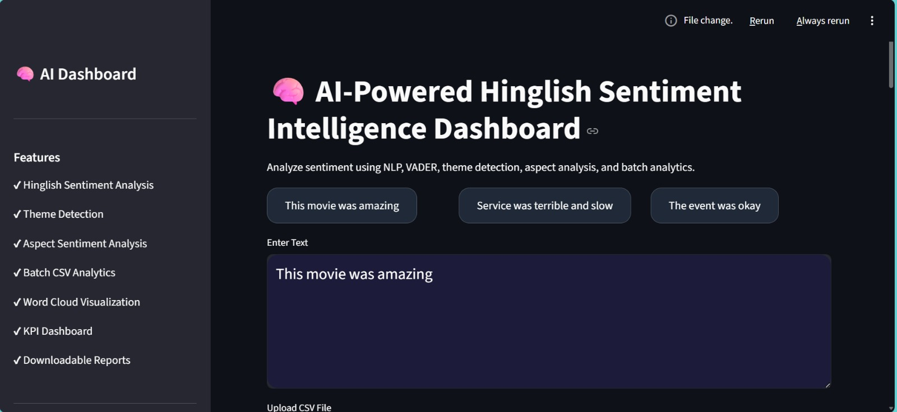
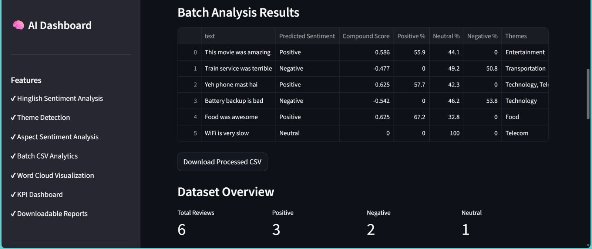
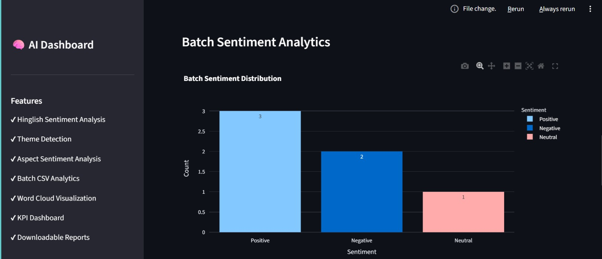

# 🧠 AI-Powered Hinglish Sentiment Intelligence Dashboard

A modern NLP-powered dashboard built to analyze Hinglish text using sentiment analysis, theme detection, aspect-based insights, batch analytics, and interactive visualizations.

This project combines Natural Language Processing, VADER sentiment analysis, and data visualization techniques to create an intelligent dashboard capable of analyzing real-world mixed Hindi-English user text in an interactive and user-friendly way.

---

# 🚀 Live Demo

🔗 **Live Application**  
Add your deployed Streamlit link here

Link:

https://ai-hinglish-sentiment-dashboard-o7zdpguf3a5kc6ddbaamed.streamlit.app/

---

# ✨ Features

### 📊 Sentiment Analysis
- Detects Positive, Negative, and Neutral sentiment
- Confidence-based sentiment scoring
- Real-time prediction dashboard

### 🧠 Theme Detection
- Automatically identifies themes from text
- Detects contextual keywords and important topics

### 🎯 Aspect-Based Sentiment Analysis
- Performs sentiment analysis on detected aspects
- Identifies opinion polarity for individual themes

### 📁 Batch CSV Analysis
- Upload CSV files for bulk sentiment analysis
- Generates predictions for large datasets
- Download processed reports instantly

### 📈 Interactive Visualizations
- Sentiment distribution charts
- KPI analytics dashboard
- Theme distribution graphs
- Interactive Plotly visualizations

### ☁️ Word Cloud Visualization
- Dynamically generates word clouds
- Highlights the most frequent and impactful words

### 🌐 Hinglish Language Support
- Supports mixed Hindi-English text
- Better suited for real-world social media and review analysis

---

# 🖼️ Project Screenshots

## 📌 Main Dashboard



---

## 📊 Batch Analysis with Theme 



---

## 🧠 Batch Sentiment Analytics



---

## ☁️ Word Cloud Visualization


---

# 🛠️ Tech Stack

| Technology | Purpose |
|---|---|
| Python | Core Programming |
| Streamlit | Interactive Dashboard UI |
| NLP | Text Processing |
| VADER Sentiment | Sentiment Scoring |
| Pandas | Data Handling |
| Plotly | Interactive Charts |
| Matplotlib | Visualizations |
| WordCloud | Word Cloud Generation |

---

# 📂 Project Structure

```plaintext
Sentiment_Thematic_Analysis/
│
├── app/
│   └── streamlit_app.py
│
├── src/
│   ├── preprocessing.py
│   ├── theme_analysis.py
│   ├── predict.py
│   └── inspect_data.py
│
├── data/
│   ├── raw/
│   └── processed/
│
├── models/
│   ├── logistic_regression_model.pkl
│   ├── linear_svc_model.pkl
│   └── vectorizer.pkl
│
├── assets/
│   ├── dashboard.png
│   ├── batch_analysis.png
│   ├── theme_analytics.png
│   └── wordcloud.png
│
├── requirements.txt
│
└── README.md
```

---

# ⚙️ Installation & Setup

## 1️⃣ Clone the Repository

```bash
git clone https://github.com/ishaan0db-ent/AI-Hinglish-Sentiment-Dashboard.git
```

---

## 2️⃣ Navigate to the Project Folder

```bash
cd AI-Hinglish-Sentiment-Dashboard
```

---

## 3️⃣ Install Required Dependencies

```bash
pip install -r requirements.txt
```

---

## 4️⃣ Run the Streamlit Application

```bash
python -m streamlit run app/streamlit_app.py
```

---

# 📊 Supported Analytics

✅ Single Text Sentiment Analysis  
✅ Batch CSV Processing  
✅ Theme Detection  
✅ Aspect-Based Sentiment Analysis  
✅ Interactive Charts & Visualizations  
✅ Word Cloud Analytics  
✅ Downloadable CSV Reports  

---

# 💡 Real-World Use Cases

- 📱 Social Media Monitoring
- 🛍️ Product Review Analysis
- 🏢 Brand Reputation Tracking
- 🎬 Entertainment Review Analytics
- 📈 Customer Feedback Intelligence
- 🗳️ Public Opinion Mining
- 📊 Business Insight Generation

---

# 🔮 Future Improvements

- Real-time Twitter & YouTube Sentiment Analysis
- Deep Learning-based NLP Models
- Multi-language Support
- AI-generated Insight Summaries
- Database Integration
- User Authentication System
- API Integration Support
- Real-time Dashboard Updates

---

# 👨‍💻 Author

## Ishaan Saraswat

🔗 GitHub:  
https://github.com/ishaan0db-ent

---

# ⭐ Support The Project

If you found this project useful, consider giving it a ⭐ on GitHub.

It helps support future improvements and open-source development.